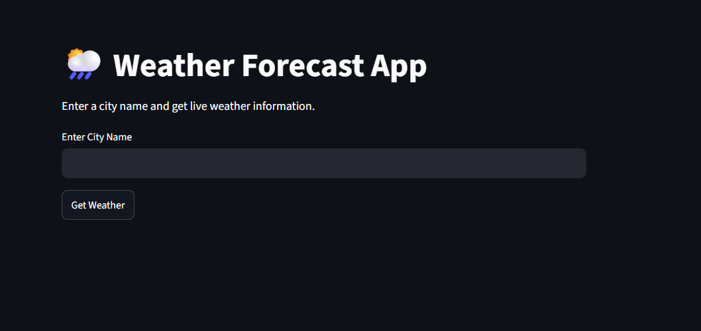
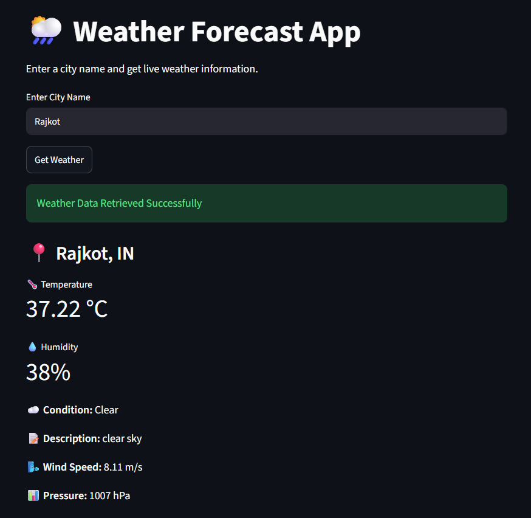

# 🌦️ Weather Forecast App

A simple and interactive Weather Forecast Web Application built using **Python**, **Streamlit**, and the **OpenWeatherMap API**. This application allows users to search for any city and get real-time weather information, including temperature, humidity, wind speed, atmospheric pressure, and weather conditions.

## 🚀 Features

* Search weather by city name
* Real-time weather data using OpenWeatherMap API
* Displays:

  * Temperature (°C)
  * Humidity (%)
  * Wind Speed (m/s)
  * Atmospheric Pressure (hPa)
  * Weather Condition
  * Weather Description
* User-friendly Streamlit interface
* Error handling for invalid city names
* Secure API key management using Streamlit Secrets

## 🛠️ Technologies Used

* Python
* Streamlit
* Requests Library
* OpenWeatherMap API

## 📂 Project Structure

```text
Weather_project/
│
├── app.py
├── requirements.txt
├── README.md
├── .gitignore
│
└── .streamlit/
    └── secrets.toml
```

## Application Screenshot

### Home Page


### Weather Result


### Live DEMO
https://weatherproject-ewz6jmvujv7wspgmb7nsvz.streamlit.app/

## 📦 Installation

### Clone the Repository

```bash
git clone https://github.com/RutikKanzariya/weather-project.git
cd weather-project
```

### Create Virtual Environment (Optional)

```bash
python -m venv .venv
```

### Activate Virtual Environment

Windows:

```bash
.venv\Scripts\activate
```

Linux/Mac:

```bash
source .venv/bin/activate
```

### Install Dependencies

```bash
pip install -r requirements.txt
```

or using UV:

```bash
uv sync
```

## 🔑 API Key Setup

1. Create a free account on OpenWeatherMap.
2. Generate an API Key.
3. Create the file:

```text
.streamlit/secrets.toml
```

4. Add:

```toml
OPENWEATHER_API_KEY = "YOUR_API_KEY"
```

## ▶️ Run the Application

Using Streamlit:

```bash
streamlit run app.py
```

Using UV:

```bash
uv run streamlit run app.py
```

## 🌍 Example Output

* City: Rajkot
* Temperature: 32°C
* Humidity: 70%
* Wind Speed: 5 m/s
* Condition: Clouds

## 📈 Future Improvements

* 5-Day Weather Forecast
* Weather Icons
* Weather Charts and Visualizations
* Location Detection
* Dark Mode UI
* Multiple Language Support

## 🎯 Learning Outcomes

Through this project, I learned:

* Working with REST APIs
* API Authentication using API Keys
* Handling JSON Responses
* Query Parameters
* Error Handling
* Building Interactive Web Apps with Streamlit
* Deploying Python Applications

## 👨‍💻 Author

**Rutik Kanzariya**

Data Science Enthusiast | Python Developer | Machine Learning Learner

If you found this project useful, feel free to ⭐ the repository.
